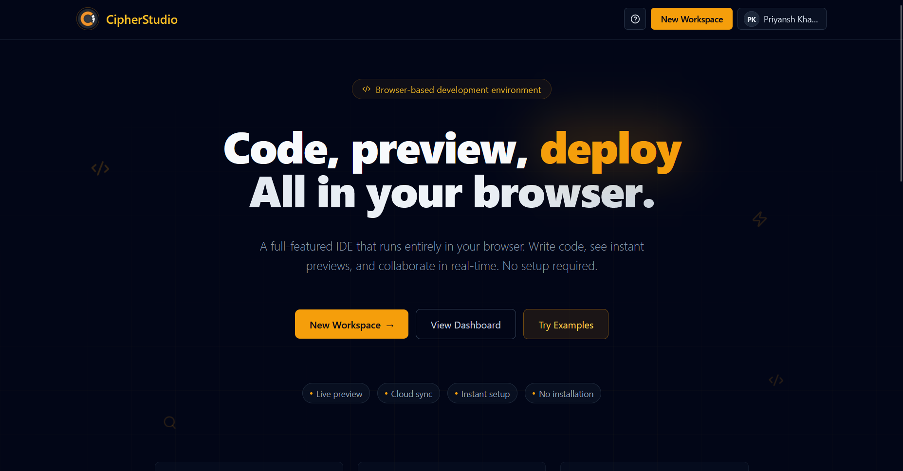
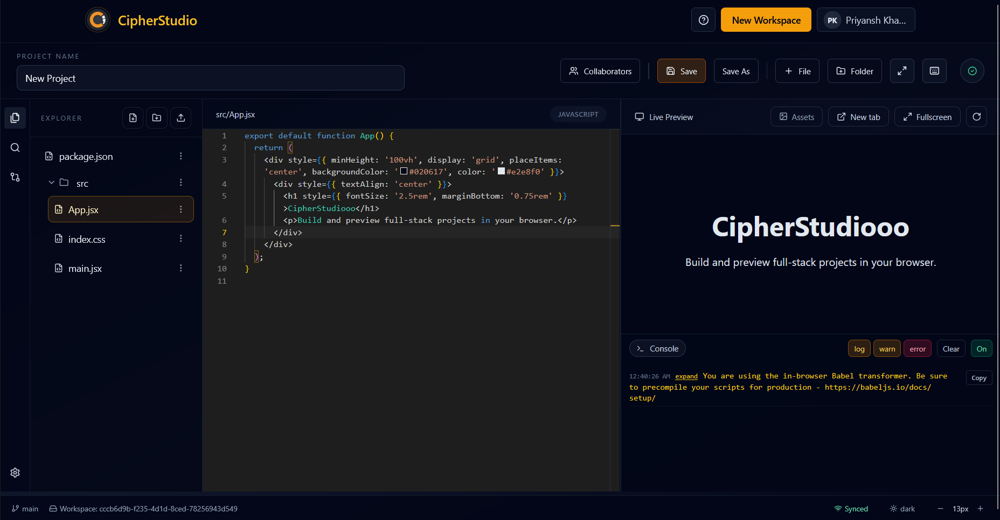
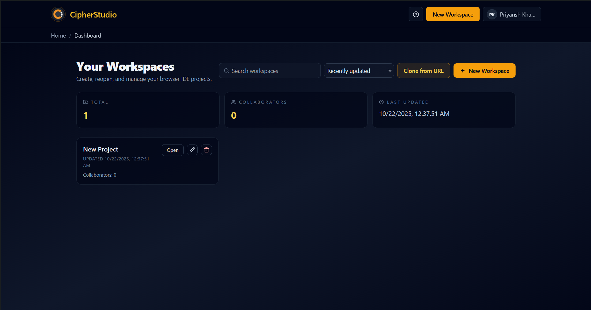
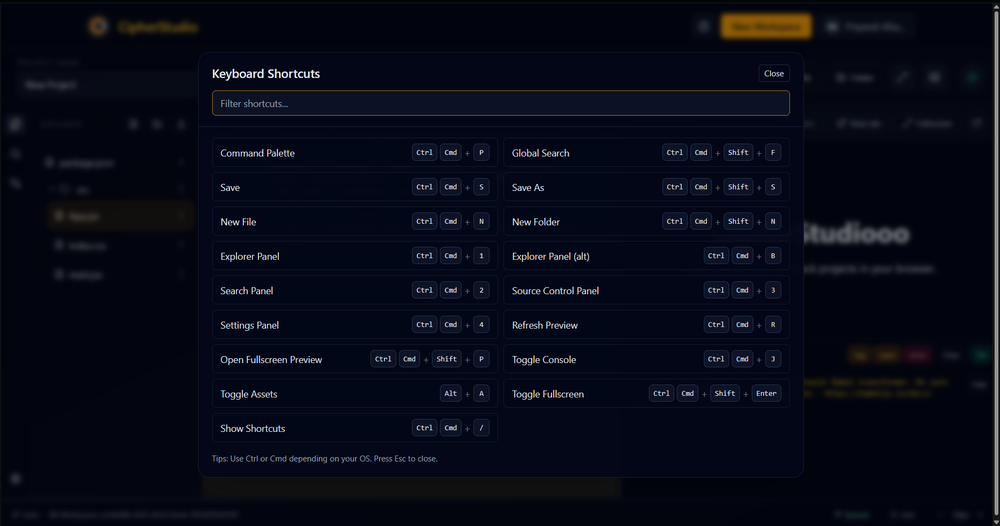

# CipherStudio

Browser-based full‑stack IDE for building, previewing, and collaborating on web projects—no local setup required.

## Overview

CipherStudio is a React + Vite single‑page app with a Node/Express + MongoDB backend. It provides an in‑browser IDE powered by Monaco, instant preview, GitHub repo import without hitting REST rate limits (via codeload tarball streaming), skeleton loading states, and a curated examples gallery that boots directly into the IDE in read‑only mode with a one‑click “Clone to edit” flow.

## Features

- Modern landing page with an amber brand theme and animated floating icons
- Dashboard with search, sort, project stats, and a functional “Clone from URL” modal
- End‑to‑end GitHub clone flow using codeload tarball streaming with size guards and compression
- Smooth skeleton loaders for dashboard cards, stats, and IDE hydration
- Examples gallery (/example) with 3 mini projects; “Start in IDE” boots instantly
- Read‑only example sessions with toast on edits and a prominent “Clone to edit” action
- Live preview with “Open in new tab” and “Fullscreen overlay”
- Global hotkey: Ctrl/Cmd+Shift+P to open fullscreen preview; discoverable via Command Palette and Shortcuts dialog
- Custom Monaco editor theme: cipher-amber-dark

## Tech stack

Frontend
- React 18
- Vite 5
- React Router v6
- Tailwind CSS 3 (utility classes)
- @monaco-editor/react (Monaco Editor)
- lucide-react (icons)
- socket.io-client
- Axios

Backend
- Node.js 18+
- Express 4
- MongoDB + Mongoose 8
- Socket.IO 4
- compression, cors, morgan
- Streaming imports: fetch (node-fetch), tar, zlib for GitHub codeload tarball

Tooling & DX
- dotenv for configuration
- nodemon for dev reload

## Monorepo layout

```
cipherstudio-frontend/   # React + Vite SPA
cipherstudio-backend/    # Express + Socket.IO API server
Documentations/          # Project docs (IDE rebuild notes, guides, PDFs)
LICENSE                  # License
README.md                # This file
```

## Requirements

- Node.js 18 or newer (LTS recommended)
- npm 9+ (bundled with Node 18+)
- MongoDB (local instance or managed like Atlas)
- Windows, macOS, or Linux
- Network access to GitHub (for cloning public repos)

Default ports
- Frontend: 5173 (Vite)
- Backend: 5000 (Express)

## Environment variables

Backend (`cipherstudio-backend/.env`; see `.env.example`)
- `PORT=5000`
- `MONGODB_URI=mongodb://127.0.0.1:27017/cipherstudio` (or Atlas URI)
- `JWT_SECRET=your-strong-secret`
- `CLIENT_URL=http://localhost:5173` (comma‑separated allowed for multiple origins)
- `GITHUB_TOKEN=ghp_...` (optional; used as a fallback when probing GitHub repo metadata)

Frontend (`cipherstudio-frontend/.env`; see `.env.example`)
- `VITE_API_URL=http://localhost:5000/api`
- `VITE_SOCKET_URL=http://localhost:5000` (optional; defaults to API URL base)

Never commit real secrets. Use the provided `.env.example` files as a template.

## Quick start (Windows PowerShell)

1) Clone the repo

```pwsh
git clone https://github.com/PriyanshK09/CipherSchools-CipherStudio.git
cd CipherSchools-CipherStudio
```

2) Backend: install, configure, run

```pwsh
Set-Location -Path .\cipherstudio-backend
Copy-Item .env.example .env
# Edit .env to set MONGODB_URI, JWT_SECRET, CLIENT_URL as needed
npm install
npm run dev
```

The API will start on http://localhost:5000.

3) Frontend: install and run

Open a new terminal tab/window:

```pwsh
Set-Location -Path .\cipherstudio-frontend
Copy-Item .env.example .env
# Ensure VITE_API_URL matches your backend, e.g. http://localhost:5000/api
npm install
npm run dev
```

Visit the app at http://localhost:5173.

### Production build

Frontend build

```pwsh
Set-Location -Path .\cipherstudio-frontend
npm run build
npm run preview
```

Backend production start

```pwsh
Set-Location -Path .\cipherstudio-backend
npm start
```

## Key capabilities in detail

### GitHub clone flow (no REST rate limits)
- Users provide a GitHub URL; the server resolves a codeload tarball (branch/tag) and streams it.
- The tarball is gunzipped, parsed, and sanitized; files are bounded (count/size) to protect the server.
- Resulting files are stored as a project and opened in the IDE.

Endpoint
- `POST /api/projects/clone` with JSON `{ url: "https://github.com/owner/repo" }`.

### IDE and Preview UX
- Monaco editor with custom “cipher-amber-dark” theme.
- Preview actions: “Open in new tab” and “Fullscreen overlay”.
- Hotkey: Ctrl/Cmd+Shift+P opens fullscreen preview; also available in Command Palette and Shortcuts dialog.

### Examples and read‑only mode
- `/example` lists three mini projects. “Start in IDE” boots an example without network hydration.
- Example sessions are read‑only: typing shows a toast; a centered banner prompts “Clone to edit” to make the example your own editable project.

### Dashboard
- Search, sort controls, hover cards, empty/loading states with skeletons.
- “Clone from URL” modal to import a GitHub repo.

## Documentation

- IDE rebuild notes: `Documentations/IDE_REBUILD.md`
- Assignment brief: `Documentations/CipherSchools _ CipherStudio - Full Stack Assignment.pdf`
- Helping guide: `Documentations/CipherStudio - Helping Guide.pdf`
- Online docs folder: https://github.com/PriyanshK09/CipherSchools-CipherStudio/tree/main/Documentations
- Changelog (GitHub commits): https://github.com/PriyanshK09/CipherSchools-CipherStudio/commits/main

## Contributing

Issues and PRs are welcome. Before contributing, please:
- Run the app locally to reproduce the problem or validate the enhancement.
- Keep changes focused, and include a brief summary and testing notes.

## License

This project is licensed under the terms of the license in `LICENSE`.

---

Questions? Open an issue or check the docs in `Documentations/`.

## Screenshots

Below are a few screenshots from the current build demonstrating the landing page, IDE, dashboard, and keyboard UI.

Landing page


IDE


Dashboard


Keyboard & shortcuts UI

